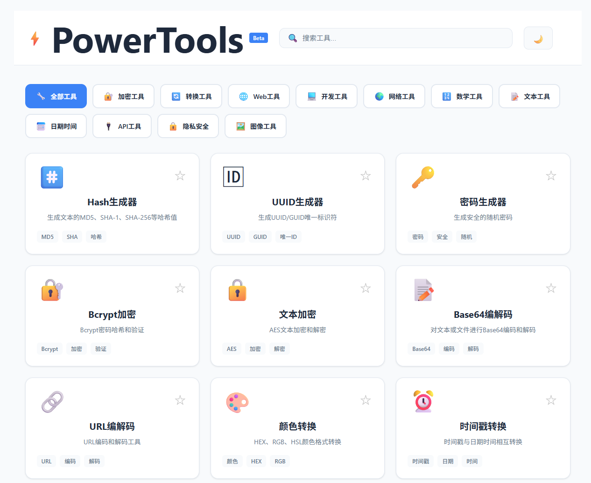
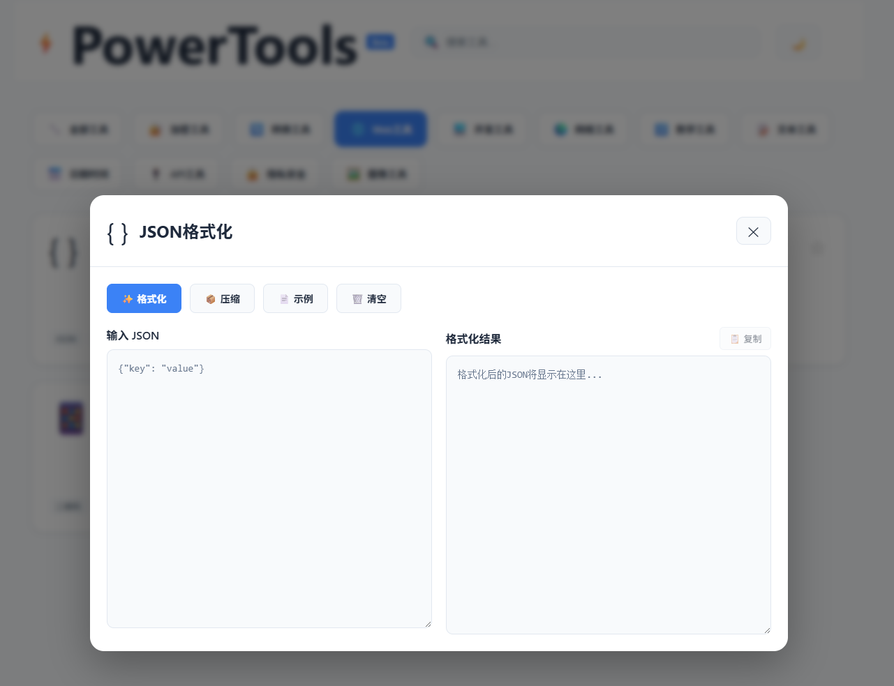
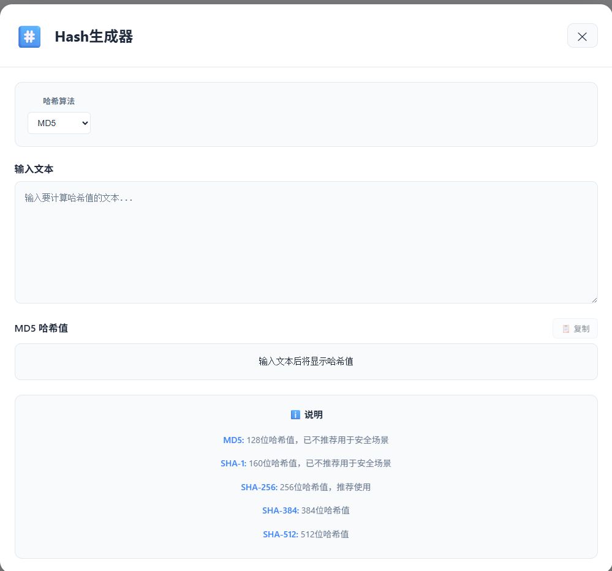
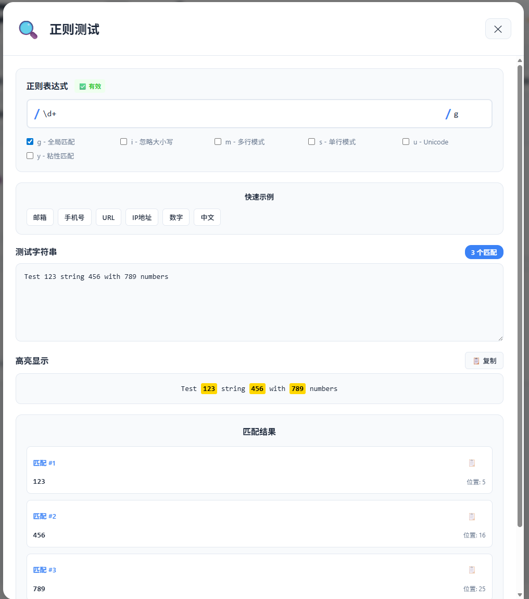

# PowerTools ⚡

<div align="center">


**Free, Open-Source, Efficient Online Developer Tools**

English | [简体中文](./README.md)

[](https://vuejs.org/)
[](https://vitejs.dev/)
[](./LICENSE)

[Live Demo](https://powertools.dev/) · [Features](#️-features) · [Quick Start](#-quick-start) · [Contributing](#-contributing)

</div>

---

## 📖 Introduction

PowerTools is a completely free online developer toolkit that provides **50+ practical development tools**, covering encryption/decryption, code formatting, API testing, text processing, image processing, and more. All tools run locally in your browser, require no installation, and protect your data privacy.

### 📸 Screenshots

<div align="center">

**Main Interface**



**JSON Formatter**



**Hash Generator**



**Regex Tester**



</div>

### ✨ Highlights

- 🚀 **Ready to Use** - No installation required, just open your browser
- 🔒 **Privacy First** - All data processed locally, never uploaded to servers
- 🎨 **Modern Design** - Beautiful UI with dark/light theme support
- 📱 **Responsive Layout** - Perfect support for PC, tablet, and mobile
- ⚡ **Lightning Fast** - Built with Vue 3 and Vite for excellent performance
- 🌍 **Open Source** - MIT License, free forever

---

## 🛠️ Features

### 🔐 Crypto Tools

| Tool | Description |
|------|-------------|
| **Hash Generator** | Supports MD5, SHA-1, SHA-256, SHA-384, SHA-512 |
| **UUID Generator** | Batch generate UUID, GUID, unique IDs |
| **Password Generator** | Generate strong passwords with custom rules |
| **Password Strength Checker** | Evaluate password security with suggestions |
| **Text Encryption** | AES encryption/decryption tool |

### 🔄 Converter Tools

| Tool | Description |
|------|-------------|
| **Base64 Encoder/Decoder** | Base64 conversion for text/files |
| **URL Encoder/Decoder** | URL encoding and decoding |
| **HTML Encoder** | HTML entity encoding/decoding |
| **Color Converter** | HEX ⇄ RGB ⇄ HSL conversion |
| **Timestamp Converter** | Unix timestamp and date conversion |
| **Unit Converter** | Length, weight, temperature conversion |
| **Number Base Converter** | Binary, octal, decimal, hexadecimal |

### 🌐 Web Tools

| Tool | Description |
|------|-------------|
| **JSON Formatter** | Format, validate, compress JSON |
| **JWT Decoder** | Parse JWT tokens |
| **QR Code Generator** | Generate downloadable QR codes |
| **Lorem Ipsum** | Generate placeholder text |

### 💻 Development Tools

| Tool | Description |
|------|-------------|
| **Text Diff Checker** | Line-by-line text comparison |
| **SQL Formatter** | SQL statement beautifier |
| **YAML ⇄ JSON** | Convert between YAML and JSON |
| **Markdown Preview** | Real-time Markdown preview |
| **Regex Tester** | Test and debug regular expressions |

### 🌍 Network Tools

| Tool | Description |
|------|-------------|
| **IP Lookup** | Query IP address information |
| **IPv4 Calculator** | Calculate subnet masks and networks |
| **DNS Lookup** | Query domain DNS records |
| **Port Checker** | Check port availability |

### 🔢 Math Tools

| Tool | Description |
|------|-------------|
| **Scientific Calculator** | Advanced mathematical operations |
| **Percentage Calculator** | Quick percentage calculations |

### 📝 Text Processing

| Tool | Description |
|------|-------------|
| **Case Converter** | 8 case conversion modes |
| **Word Counter** | Count characters, words, lines |
| **Text Batch Add** | Batch add prefix/suffix |

### 📅 DateTime Tools

| Tool | Description |
|------|-------------|
| **Date Calculator** | Calculate date intervals and offsets |
| **Workday Calculator** | Calculate business days |
| **Timezone Converter** | Cross-timezone time conversion |
| **Countdown Timer** | Event countdown tool |

### 🔌 API Tools

| Tool | Description |
|------|-------------|
| **HTTP Request Tool** | Send HTTP requests to test APIs |
| **Mock Data Generator** | Generate test data |
| **API Doc Formatter** | API documentation template |
| **cURL Converter** | Convert cURL commands |

### 🔒 Privacy & Security

| Tool | Description |
|------|-------------|
| **Data Masking** | Mask phone numbers, ID cards, etc. |
| **Privacy Checker** | Detect privacy information in text |
| **Secure Delete** | Multi-level secure text deletion |

### 🖼️ Image Tools

| Tool | Description |
|------|-------------|
| **Image Preview** | View and download images |
| **Base64 Converter** | Convert images to/from Base64 |
| **Image Info Viewer** | View image EXIF information |
| **Placeholder Generator** | Generate placeholder images |

---

## 🚀 Quick Start

### Online Usage

Visit [https://powertools.dev/](https://powertools.dev/) to use all tools immediately.

### Local Deployment

#### Requirements

- Node.js >= 16.0.0
- npm >= 8.0.0

#### Installation

```bash
# 1. Clone the repository
git clone https://github.com/Edison0621/powertools.git
cd powertools

# 2. Install dependencies
npm install

# 3. Start development server
npm run dev

# 4. Build for production
npm run build

# 5. Preview production build
npm run preview
```

Visit `http://localhost:5173` to view the project.

---

## 🎨 Tech Stack

- **Framework**: [Vue 3](https://vuejs.org/) - Progressive JavaScript Framework
- **Build Tool**: [Vite](https://vitejs.dev/) - Next Generation Frontend Tooling
- **Language**: JavaScript ES6+
- **Styling**: Native CSS + CSS Variables
- **Encryption**: Web Crypto API + Custom MD5
- **Icons**: Emoji (Zero Dependencies)

---

## 📂 Project Structure

```
powertools/
├── public/                # Static assets
│   ├── robots.txt        # Search engine crawler config
│   └── sitemap.xml       # Sitemap
├── src/
│   ├── components/       # Vue components
│   │   ├── ToolCard.vue # Tool card component
│   │   ├── ToolPage.vue # Tool detail page component
│   │   └── tools/       # Individual tool components
│   ├── data/            # Data configuration
│   │   └── tools.js     # Tools list configuration
│   ├── App.vue          # Root component
│   └── main.js          # Entry file
├── index.html           # HTML template
├── package.json         # Project configuration
└── vite.config.js       # Vite configuration
```

---

## 🎯 Roadmap

### ✅ Completed

- [x] 50+ core tools implementation
- [x] Dark/light theme switching
- [x] Responsive layout (PC + Mobile)
- [x] Tool search and category filtering
- [x] Favorites feature
- [x] SEO optimization
- [x] Sitemap and Robots.txt

### 🚧 In Progress

- [ ] PWA support (offline capable)
- [ ] Multi-language support (Chinese/English)
- [ ] Tool usage history

### 📋 Planned

- [ ] Data transfer between tools
- [ ] Keyboard shortcuts support
- [ ] Import/export configuration
- [ ] More image processing tools
- [ ] Data visualization tools
- [ ] Code snippet management

---

## 🤝 Contributing

All forms of contribution are welcome!

### How to Contribute

1. Fork this repository
2. Create your feature branch (`git checkout -b feature/AmazingFeature`)
3. Commit your changes (`git commit -m 'Add some AmazingFeature'`)
4. Push to the branch (`git push origin feature/AmazingFeature`)
5. Open a Pull Request

### Contribution Guidelines

- Follow existing code style
- Add documentation for new features
- Ensure code passes tests
- Write clear commit messages

---

## 📄 License

This project is licensed under the [MIT](./LICENSE) License.

---

## 🙏 Acknowledgments

- Design inspiration from [IT-Tools](https://it-tools.tech/)
- Thanks to all contributors

---

## 📧 Contact

- Bug Reports: [GitHub Issues](https://github.com/yourusername/powertools/issues)
- Feature Requests: [GitHub Discussions](https://github.com/yourusername/powertools/discussions)

---

<div align="center">

**[⬆ Back to Top](#powertools-)**

Made with ❤️ by PowerTools Team

</div>
